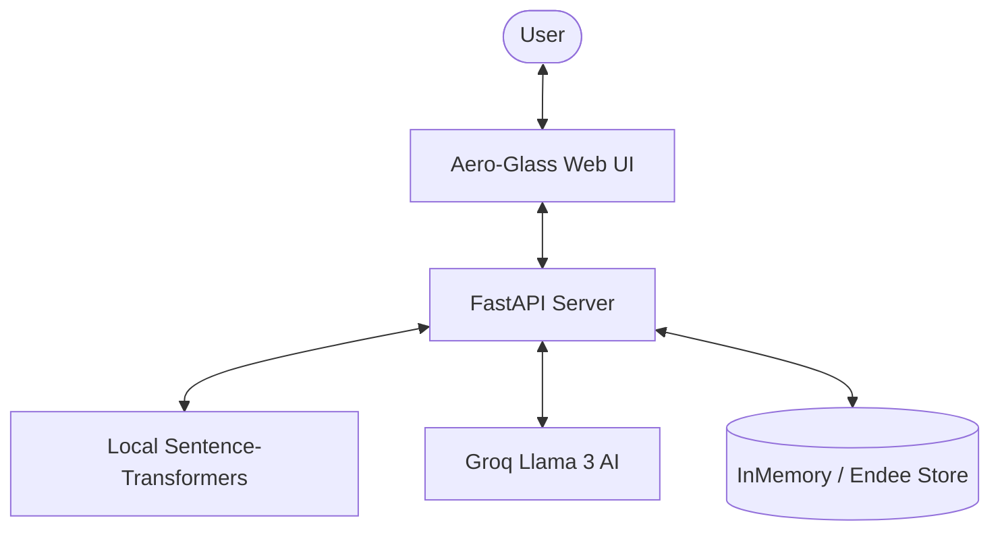

# 🌌 NebulaRAG: Free & Open Source Edition 🚀

A high-performance, **100% Free** Retrieval-Augmented Generation (RAG) system with a stunning Aero-Glass interface.


## 🌟 Key Features

- **100% Free Embeddings**: Uses `sentence-transformers` (`all-MiniLM-L6-v2`) running locally on your CPU—no OpenAI account or credits needed.
- **Free LLM Provider**: Integrated with **Groq** for blazing-fast Llama 3 answers (Free tier).
- **Premium Web UI**: High-end Aero-Glass chat interface with frosted glass effects and real-time animations.
- **Dynamic Retrieval**: Powered by **Endee Vector Store** (with an in-memory fallback for instant setup).
- **Interactive Dashboard**: Easily ingest new documents and see source relevance scores.

## 🏗️ Architecture



## 🚀 Quick Start

### 1. Installation
Clone the repository and install dependencies:
```powershell
git clone <your-repo-url>
cd endee-rag-demo
pip install -r requirements.txt
pip install sentence-transformers groq
```

### 2. Configuration
Create a `.env` file (see `.env.example`):
```env
EMBEDDING_PROVIDER=local
LLM_PROVIDER=groq
GROQ_API_KEY=gsk_your_free_key_here
API_BASE_URL=http://localhost:8002
```

### 3. Run the App
Start the FastAPI server:
```powershell
python -m uvicorn app.main:app --host 0.0.0.0 --port 8002
```
Access the UI at: **[http://localhost:8002](http://localhost:8002)**

## 🛠️ Usage

### Interactive Web UI
1. Open the website in your browser.
2. **Ingest**: Use the sidebar to paste text or documents into the AI's knowledge base.
3. **Ask**: Type complex questions in the chat. The AI will retrieve the most relevant documents and give you a summarized answer.

### CLI Demo
Run the automated test suite to see the full RAG pipeline in action:
```powershell
python examples/rag_demo.py
```

### Interactive CLI
Ask questions directly from your terminal:
```powershell
python ask.py
```

## 🔒 Privacy & Local First
By default, this project generates **embeddings locally**. Your raw data never leaves your machine during the vectorization process. Only the final prompt and retrieved context are sent to the LLM provider (Groq/OpenAI).

## 📄 License
This project is licensed under the MIT License.
